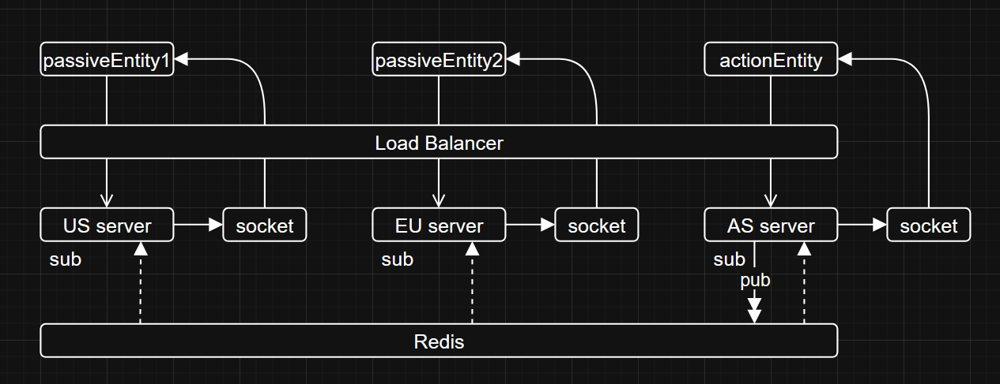

# 🌎 Multi-region servers

✨ **What this app does:**  
This app demonstrates how users can connect from different regions while ensuring data sync. 

## 🏗️ Architecture



📖 **Example scenario:**

1. Users log into the app through the US and EU server.
2. A user logs into the app through the AS server and triggers an event.
3. All servers promise to receive events from other servers and forward it to their clients.
4. Because of (3), clients across all regions get the event in real time when AS server fires an event.

**Tech stack:**

- 🧠 **Redis** - Acts as message broker to enable cross-server communication.
- ⚡ **Socket.io** - Acts as websocket layer to enable server-client communication.
- 🌐 **Express** - Implements backend logic.
- ⚛️ **Next.js** - Delivers a responsive frontend with fast dev environment performance.

---

## 🏁 Quick-start Instructions

### Prerequisites

📥 Install NPM and Node.js (required for the project).

🐋 Install Docker if not already installed.

### Setup

```bash
# 1. Clone the project
git clone https://github.com/zhtgeneral/MultiRegionServers.git

# 2. Install dependencies
cd MultiRegionServers 
cd client && npm install
cd ../server && npm install
```

## 💻 Running the app

Follow this guide to run the app.

### Manual method (faster for development)

⚠️ Ensure the packages are installed from the previous step.

🖥️ Open up 6 terminals in VSCode and run each of the scripts.

**Running the clients (start from /client):**

```
npm run dev:as
```

```
npm run dev:us
```

```
npm run dev:eu
```

**Running the servers (start from /server):**

```
npm run dev:as
```

```
npm run dev:us
```

```
npm run dev:eu
```

Visit the frontends through the browser at

```
http://localhost:4000 (for AS server)
http://localhost:4001 (for US server)
http://localhost:4002 (for EU server)
```

When the browser loads, it will send an event to the region-specific server which gets synced to the servers and clients of other regions.

### Docker method (slower for deployment)

⚠️ Ensure Docker is running.

Run this script:

```
docker-compose up --build
```

⚠️ Note: Loading takes significantly longer

Once it loads, you can visit the region-specific frontends through the browser at 

```
http://localhost:4000 (for AS server)
http://localhost:4001 (for US server)
http://localhost:4002 (for EU server)
```

# MultiRegionServers
